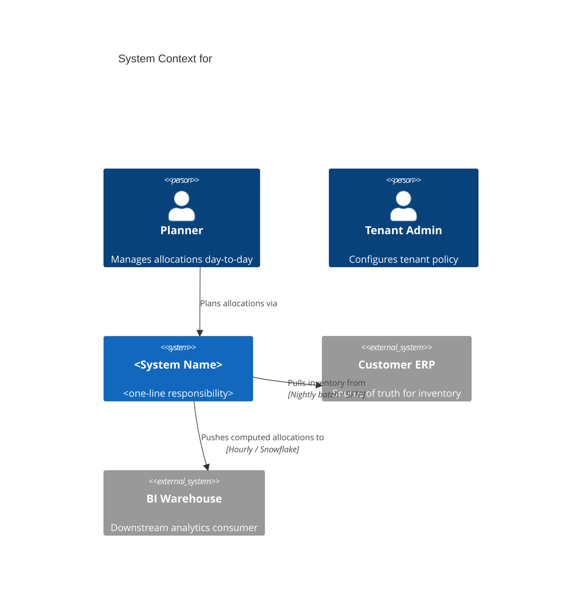
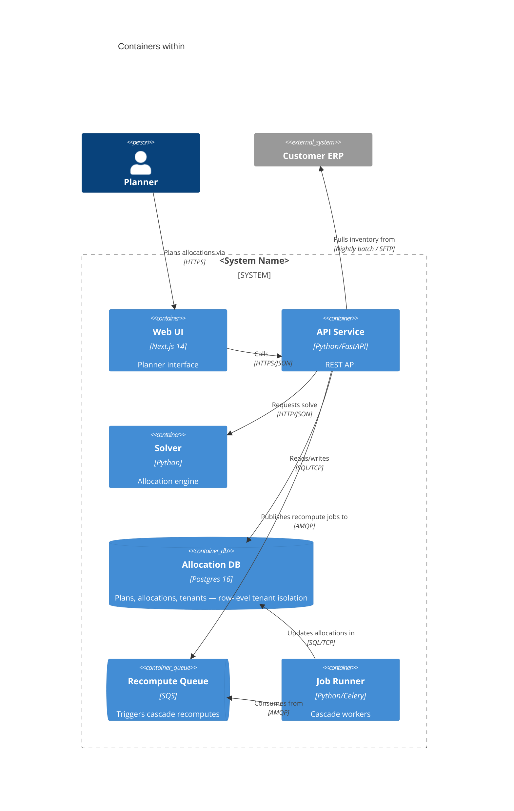
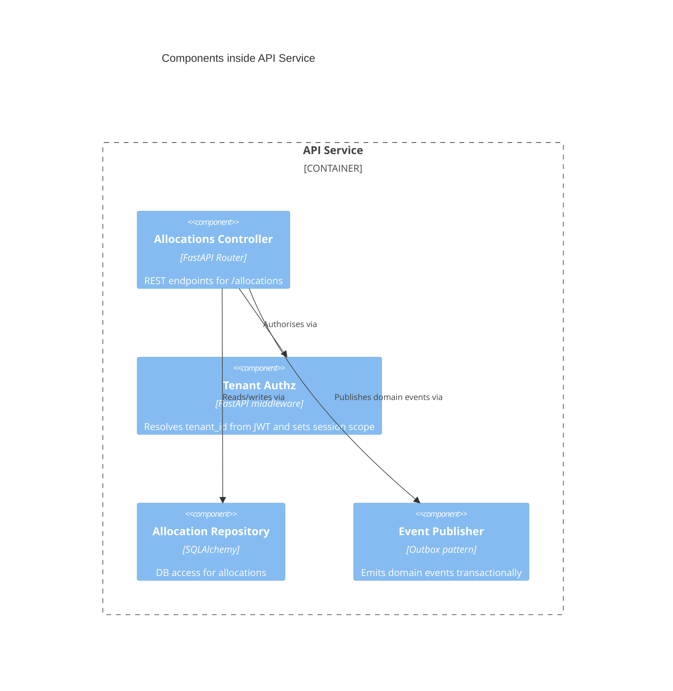

# Skill: dkarchitect

Bootstrap or refresh the project's canonical architecture map at `.doyaken/architecture.md`. The output is a **C4 model** at the first three levels:

- **Level 1 — System Context**: the system in scope, its users, and external systems it talks to.
- **Level 2 — Container**: deployable / runnable units inside the system (web app, API service, database, worker, queue, etc.) with their technologies.
- **Level 3 — Component**: components inside each non-trivial container (modules / packages with well-defined interfaces).

Level 4 (Code) is **intentionally out of scope** — it lives in the source itself and rots faster than a markdown file can track. See https://c4model.com for the underlying model.

## When to Use

- Invoked by `dkrefine` (via the Skill tool) when `.doyaken/architecture.md` does not exist.
- Invoked directly inside a Claude session via `/dkarchitect [<focus area>]` to bootstrap a missing map or to refresh a stale one.

**Plan mode is incompatible with this skill** — it writes a workspace file. If the agent is in plan mode when invoked, stop and tell the user to exit plan mode and re-invoke directly.

This skill does **not** commit, does **not** branch, does **not** push, does **not** modify production code.

## C4 Vocabulary (enforced)

This is the operative definition of each abstraction. Apply it verbatim — do not invent synonyms ("pillar", "module", "service") in place of the C4 term.

- **Person.** An actor, role, persona, or named individual that uses the software system. Examples: a planner, an admin, an oncall engineer, an external customer.
- **Software System.** The highest level of abstraction. Something **the team owns, builds, deploys, and can see the internal implementation details of** — typically one source repository, owned by one team boundary. A software system delivers value to its users. **Not the same as** a product domain, bounded context, business capability, tribe, squad, or feature team. If you are unsure where the system boundary lies, ask the user.
- **Container.** A **runtime** unit — an application or a data store — that needs to be running for the overall software system to work. Concrete examples:
  - Server-side web app (Spring MVC, Rails, Django, ASP.NET, FastAPI, Express, …).
  - Single-page application (React, Vue, Angular, Svelte, …).
  - Desktop or mobile app.
  - Console / batch / scheduled-job application.
  - Serverless function (Lambda, Cloud Function, Azure Function, …).
  - Database **schema** (Postgres, MySQL, Mongo, DynamoDB, …).
  - Blob / object / content store (S3 bucket, GCS bucket, Azure Blob, CDN edge).
  - Message **queue** or **topic** (each individual queue/topic is one container — not the broker).
  - File system path.
  - Long-lived shell daemon.
- **What a container is NOT.** A JAR, DLL, NuGet package, npm module, Python package, Go package, namespace, folder, or repository — these are code-organisation constructs, not runtime units. Do not list them as containers.
- **Component.** A grouping of related functionality encapsulated behind a well-defined interface, **executing in the same process space as other components in its container**. Examples: a controller, a domain service, a repository, an event publisher, an authorization middleware. A component is **not separately deployable** — the container is the deployable unit. Components are **not** packages, JARs, DLLs, or folders.
- **Managed cloud services.** If the team owns the resource (its bucket, its schema, its queue), model it as a container regardless of who hosts the underlying hardware. S3 buckets, RDS schemas, SNS topics, SQS queues, Cloud SQL databases all count.
- **Microservices scope rule (Conway's Law).** Two valid framings; pick one and apply it consistently across the map:
  1. **Single team owns multiple services** → the whole thing is **one** software system; each microservice is a **group of containers** (API + DB schema + queues, …) inside that one boundary.
  2. **Each service is owned by a different team** → each microservice is **its own** software system; pick the one in scope for this map (the one this repo / team owns) and draw external services as `System_Ext`.
  - If the team topology is ambiguous from the codebase alone, **ask the user** before drawing.
- **Queues and topics.** Each queue or topic is a container (data store). The broker that hosts them is **not** a container — it's deployment infrastructure. Alternatively, for a simple point-to-point relationship, model it implicitly via a `Rel(producer, consumer, "Sends X via queue Y", "AMQP")` label and omit the queue box (only when the queue is otherwise uninteresting).

## Notation Rules (enforced)

Every diagram in `architecture.md` must satisfy these:

1. **Title.** Every mermaid block has a `title`.
2. **Element type explicit.** Use `Person()`, `System()`, `System_Ext()`, `Container()`, `ContainerDb()`, `ContainerQueue()`, `Component()` — never a bare box. Each call has `id, "label", "technology", "description"` arguments where applicable (technology slot is mandatory for Container/Component).
3. **Every relationship is unidirectional.** Use `Rel(from, to, "verb", "protocol/technology")`. The verb must be specific — `"Sends payment events"`, `"Queries account balance"`, `"Renders dashboard for"` — not `"Uses"` or `"Calls"`. For container-level relationships, the protocol/technology slot is mandatory (`HTTPS/JSON`, `SQL/TCP`, `AMQP`, `gRPC`, …).
4. **Description on every element.** Short — one clause. Says what it does for the system, not what it is technically.
5. **No deployment topology.** Clustering, load balancers, replication, failover, autoscaling groups belong in a deployment diagram and are **out of scope** for this skill. If a load balancer materially shapes the system architecture (e.g. it terminates TLS and authenticates), name it once in prose; otherwise omit.
6. **Prose / table fallback.** Every diagram is followed by a prose table containing the same information. Mermaid C4 support is still experimental in many renderers — the table is the reliable rendering.
7. **Diagram key.** Each section explicitly states the legend (what shape / `_Ext` suffix means). One paragraph per section, not per diagram.
8. **Selectivity at Level 3.** Component diagrams are recommended **only when they add value**. Trivial containers (a Postgres database, a Redis cache, an SQS queue, a vanilla Nginx) get a one-line note in the Containers section instead of a full Level-3 diagram. Skip Level 3 outright for a container if its internals are mechanical (single-file lambda, thin CRUD service generated from schema).

## Output Contract

A single file at `<repo-root>/.doyaken/architecture.md` with this exact top:

```
---
generated-by: dkarchitect
last-refreshed: <YYYY-MM-DD>
refreshed-from: <input or "manual refresh">
---

# Architecture Map

> C4 model (levels 1-3). Level 4 (Code) is intentionally out of scope — read the source for that.
```

Followed by the six sections defined in **Step 4** below. The Level 1-3 sections (1-3) are canonical C4; sections 4-6 (Multi-tenancy, Plug-points, Data Flow) are **doyaken-specific supplementary** sections — they exist because every refinement needs them, not because they are part of C4.

If the file already exists, **overwrite it** and announce so prominently in the final summary. Git history is the user's recovery path; this skill is not responsible for backups.

## Steps

### 1. Refuse if in plan mode

Plan mode forbids writing non-plan files. Before doing anything else:

- If the parent session is in plan mode (the agent was told to `EnterPlanMode` or sees plan-mode indicators), **stop**. Tell the user to call `ExitPlanMode` first (or run `dkarchitect` outside the plan-mode context) and re-invoke.

### 2. Gather Context

1. Determine the **repo root**: `git rev-parse --show-toplevel`. Refuse if not in a git repo.
2. Read top-level documentation:
   - `AGENTS.md`, `CLAUDE.md`, `README.md`
   - Anything in `docs/` (especially `docs/architecture*`, `docs/adr*`)
   - `.doyaken/doyaken.md` if present (integrations + rule references)
3. Read the package manifests to detect the **tech stack** in each container: `package.json`, `pyproject.toml`, `requirements*.txt`, `go.mod`, `Cargo.toml`, `pom.xml`, `Gemfile`, etc.
4. List the top-level service / app directories: `apps/`, `services/`, `packages/`, `cmd/`, `src/`. Each candidate is potentially a container, potentially its own software system — see scope decision below.
5. Skim the entry-points (`main.ts`, `__main__.py`, `cmd/*/main.go`, etc.) to confirm what each container actually does.
6. Locate **external** integration touchpoints: outbound HTTP clients, webhook handlers, env vars referencing external URLs (`*_BASE_URL`, `*_API_KEY`), deployment configs (`terraform/`, `pulumi/`, `helm/`).
7. **Scope decision.** Decide what counts as **the software system in scope** for this map:
   - If the repo is a single deployable product with one team → one software system, everything inside is containers.
   - If the repo houses multiple microservices owned by the same team → one software system, each service is a group of containers (API + its schema + any queues it owns).
   - If the repo houses microservices owned by different teams → each service is its own software system; this map covers **one** of them. Ask the user which one, or infer from doyaken.md / CODEOWNERS if unambiguous.
   - If you cannot determine the scope from the codebase alone, **ask the user** before proceeding.

If a focus-area argument was passed (e.g. `/dkarchitect billing`), bias the **Level 3 Component** detail toward that area — still cover all containers at Levels 1-2.

### 3. Identify the C4 elements

Build these lists in working memory before drawing any diagram. Apply the C4 Vocabulary above strictly.

**People** (Level 1):

- Discover from auth/permission code, UI routes, doyaken.md, README, CODEOWNERS.
- Include primary users (planner, admin, end-customer, …) and operators (oncall, support) if relevant.

**External Systems** (Level 1):

- ERPs, identity providers, payment processors, mail/SMS gateways, analytics, BI warehouses, downstream consumers, upstream data sources.
- Discover from outbound HTTP clients, webhook handlers, env vars referencing external URLs, deployment configs.

**Containers** (Level 2) — apply the C4 Vocabulary container definition strictly:

- One per deployable/runnable unit inside the in-scope software system. Include: web UIs, API services, workers, batch jobs, **each database schema**, caches, blob stores, **each queue/topic** owned by the system.
- Do **not** include: JARs/DLLs/packages/modules/namespaces/folders. Do **not** include the message broker itself (only the queues/topics on it). Do **not** include clusters, load balancers, or other deployment topology.
- Apply the microservices scope rule: do not draw services owned by other teams as containers — they are `System_Ext`.
- For each container: name, technology (e.g. `Python/FastAPI`, `Postgres 16`, `Next.js 14`, `SQS`), responsibility (one sentence), path on disk, tenancy mode (see Section 4 below).

**Components** (Level 3) — one diagram per **non-trivial** container; skip the rest with a one-line note:

- Significant modules / packages / classes with a clear interface boundary. Examples to include: controllers, domain services, repositories, event publishers, authorization middleware.
- Examples to **omit**: utility/helper modules, DTOs, model classes (they are data), one-off scripts.
- All components in a Level-3 diagram execute in the same process space as the container — never split a single container's components across multiple diagrams.

**Multi-tenancy boundary** (cross-cutting):

- Where is `tenant_id` (or equivalent) enforced? Column? Schema-per-tenant? Row-level security? Request middleware? Document the pattern verbatim — every new entity must inherit it.

**Reusable plug-points** (cross-cutting):

- Existing strategy/plugin interfaces, registries, factories, cascade machinery, exception frameworks. List name, path, current implementations.

### 4. Compose `architecture.md`

Write the file with these sections, in this order. Every mermaid block is followed by a **prose table** equivalent — the table is the reliable fallback.

#### Section 1 — System Context (Level 1)

One `C4Context` mermaid block. Include every Person and every System (in-scope + external), with labelled `Rel` arrows.



Followed by:

- One sentence stating the system's mission.
- One sentence stating the value boundary (what's inside vs. outside).
- A People-and-External-Systems table mirroring the diagram (`Element | Type | Description | Relationship to system`).
- Diagram key paragraph: "Boxes labelled `System_Ext` are external systems the team does not own."

#### Section 2 — Containers (Level 2)

One `C4Container` mermaid block, then a **container table**.



Followed by a **container table**:

| Container | Technology | Responsibility | Path | Tenancy mode |
|-----------|------------|----------------|------|--------------|

`Tenancy mode` is one of: `shared-DB row-level (tenant_id)`, `schema-per-tenant`, `stateless / from JWT`, `not tenant-aware (justified)`. Anything `not tenant-aware` requires a justification — global config, oncall tooling, etc.

Diagram key paragraph: explain `ContainerDb` = data store; `ContainerQueue` = queue/topic; `System_Ext` = external system.

#### Section 3 — Components (Level 3)

One `C4Component` mermaid block per non-trivial container, each followed by a **component table** for that container:



| Component | Role | Path | Key dependencies |
|-----------|------|------|------------------|

For trivial containers (Postgres, Redis, SQS, an Nginx instance): one line in the Containers section is enough — `Allocation DB — schema documented in repo/migrations/, no Level-3 diagram needed`.

#### Section 4 — Multi-tenancy Boundary (doyaken supplement)

Not part of canonical C4. Required for every doyaken project because the platform constraint mandates it.

Prose + a checklist. State the pattern verbatim, citing a file/line you read to confirm:

> Every persisted entity has a `tenant_id UUID NOT NULL` column. Every API request resolves `tenant_id` from the JWT (`api/middleware/tenant_authz.py:42`) and the SQLAlchemy session sets `SET LOCAL app.tenant_id` so row-level security policies filter automatically. Background jobs receive `tenant_id` as a task argument; the worker re-applies the session variable before any query.

New-entity checklist:

- [ ] Carries `tenant_id`?
- [ ] Inherits the standing isolation mechanism (RLS / scoped session / etc.)?
- [ ] Tenant-aware unique constraints?
- [ ] Tenant-aware test fixtures?

#### Section 5 — Reusable Plug-points (doyaken supplement)

Not part of canonical C4. Required for the dkrefine "reuse beats invent" check.

| Interface | Path | Purpose | Registered implementations | v2 candidates |
|-----------|------|---------|---------------------------|---------------|

Plus one sentence per plug-point on **how to add a new implementation** (do you register, subclass, decorate, etc.).

#### Section 6 — Data Flow (doyaken supplement)

System-level data flow narrative — what flows where, sync vs. async, persistence boundaries. Keep it short (5-10 sentences). If a single hot path materially clarifies the system, include one `sequenceDiagram` mermaid block; otherwise skip — long sequence diagrams belong in ADRs, not the canonical map.

### 5. Quality Gate

Before writing the file, verify all of the following.

**C4 conformance:**

1. Every mermaid block has a `title`.
2. Every element uses an explicit C4 type call (`Person`, `System`, `System_Ext`, `Container`, `ContainerDb`, `ContainerQueue`, `Component`).
3. Every Container and Component has a technology specified.
4. Every `Rel(…)` has a specific verb (not `"Uses"` / `"Calls"` alone). Every container-level `Rel(…)` has a protocol/technology label.
5. Every diagram is followed by a prose table containing the same information.
6. Every section has a diagram-key paragraph explaining shape/suffix semantics.

**Coverage:**

7. Level 1 has at least one Person and at least one External System (zero of either is suspicious — call it out if genuinely none).
8. Level 2 lists every directory under `apps/`, `services/`, `packages/` that contains an entry-point. No silent omissions.
9. Level 2 includes every owned database **schema**, blob store, queue, and topic as its own container.
10. The microservices scope rule was applied consistently — no service owned by another team appears as a `Container`; if it appears at all, it is `System_Ext`.
11. Level 3 has at least one diagram per non-trivial Level-2 container, **or** an explicit one-line "trivial — see container table" note for skipped containers.

**Doyaken cross-cutting:**

12. Multi-tenancy section is non-empty and cites a file/line from the actual code.
13. Every Level-2 container has a Tenancy mode set in the container table.
14. Plug-points section lists every existing strategy/registry interface discovered in §3 (or `— none found`).

**Hygiene:**

15. Every path cited in the file resolves to a real path in the repo. No invented filenames.
16. No JARs / DLLs / packages / modules / namespaces / folders are listed as Containers or Components.
17. No deployment topology (clusters, LBs, replication, autoscaling) appears in any diagram.

### 6. Write the File

1. Compute `.doyaken/architecture.md` path relative to the repo root.
2. If the file already exists, capture its `last-refreshed` value (if any) — you will mention "overwriting <date>" in the final summary.
3. Write the new content.
4. Print a final summary:
   - Confirmation that the file was written (or overwritten — name the previous `last-refreshed` date).
   - One-line summary of each Level-2 container.
   - Scope-decision call-out (`Single software system: <name>` or `Multi-team — scoped to <name>`).
   - The exact git command for the user to commit: `git add .doyaken/architecture.md && git commit -m "docs: bootstrap architecture map"` (or `"refresh"` for overwrites).
   - **The skill never commits.** The user owns the commit.

## Notes

- `dkarchitect` is the canonical source of `.doyaken/architecture.md`. Anything else that needs the map (`dkrefine` today, future skills tomorrow) **reads** the file rather than rebuilding inline.
- C4 is notation-independent in principle — this skill commits to **mermaid C4 + prose-table fallback** for consistency. Tools that auto-generate or auto-validate the diagrams (Structurizr DSL, PlantUML / C4-PlantUML) are out of scope for v1.
- Mermaid's C4 support is still labelled experimental in many renderers — the prose tables in each section are the reliable rendering. Always include both.
- This skill is intentionally narrow: build / refresh one markdown file at C4 levels 1-3. It does **not** generate ADRs, deployment diagrams, sequence diagrams for arbitrary flows, system-landscape diagrams (multiple systems), or Level-4 code diagrams.
- When invoked from `dkrefine` via the Skill tool, the parent session is expected to be **outside** plan mode (the `dkrefine` shell wrapper handles this ordering). If you find yourself in plan mode anyway, refuse per Step 1.
